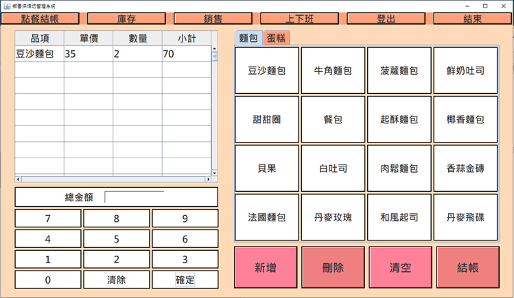

# 鄉香烘焙坊POS系統
系統分析與設計課程專案

這項專案是為期兩個學期的「系統分析與設計」課程實作，這個團隊由兩個人組成，使用的程式語言為JAVA、資料庫管理系統使用的是MySQL。
  
## 系統介面
### 登入畫面
1.	輸入帳號密碼，進入前台或後台系統。
2.	未輸入帳號或密碼，輸入帳號密碼錯誤，皆會顯示訊息提示錯誤。

### 前台點餐頁面
1.	選擇右邊商品品項。
2.	點選數字鍵區選擇數量，並點擊「確定」計算小計。
3.	欲增加下一筆品項，需點擊下方「新增」並重複1、2步驟即可完成新的品項。
4.	完成所有品項點選，即可按下結帳，進行後續步驟。

### 結帳頁面
1.	輸入所收取的現金金額。
2.	按下「Enter」進行找零計算。
3.  按下「確定」即可完成結帳動作。

### 庫存頁面
1.	顯示所有庫存數量。
2.	選取分類品項在按下「查詢」，即可顯示所查詢之品項。

### 銷售頁面
1.	點選左側銷售編號，即可在右方銷售明細中查看。
2.	選擇日期及可查詢該日期之銷售資料。

### 上下班打卡頁面
1.	輸入員工編號及員工密碼，按下「Enter」即可顯示員工姓名。
2.	按下「打卡」，即可完成打卡。

### 後台更新產品頁面
1.	選擇分類及品項，按下「更改」，即可進行單價及數量的變更。
2.	新的單價及數量輸入完成後，按下「完成」即可更新。

### 後台人事員工頁面
1.	顯示所有員工名單資料。
2.	可任意點擊表單，進行員工資料刪除。

### 後台新增員工頁面
1.	輸入員工編號、姓名、職位、密碼，按下「新增」，即可完成員工資料新增。

